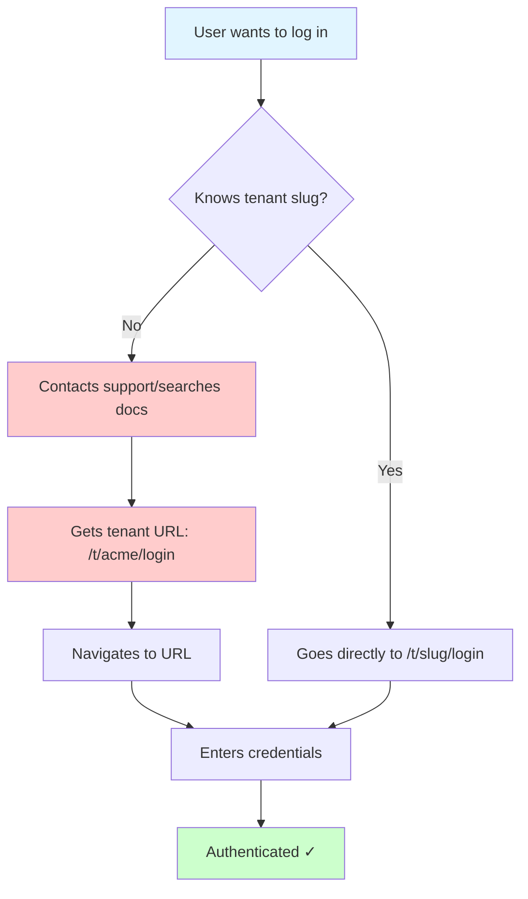
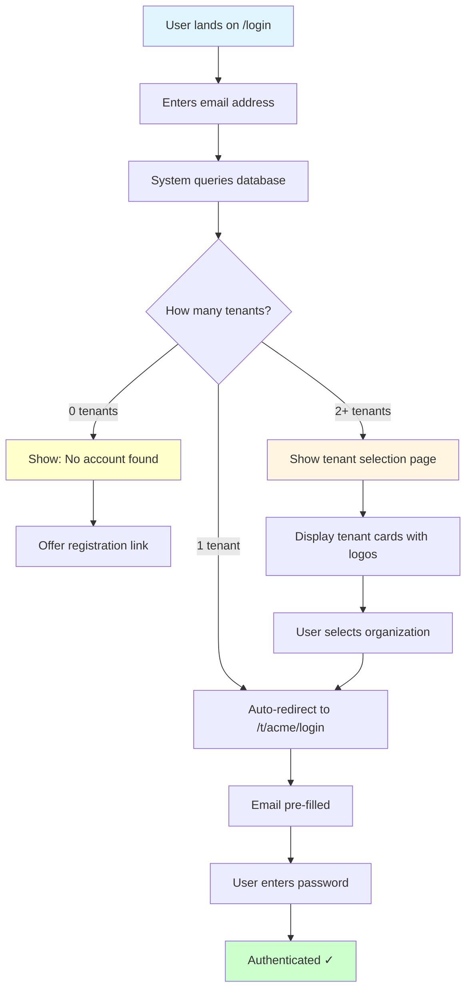
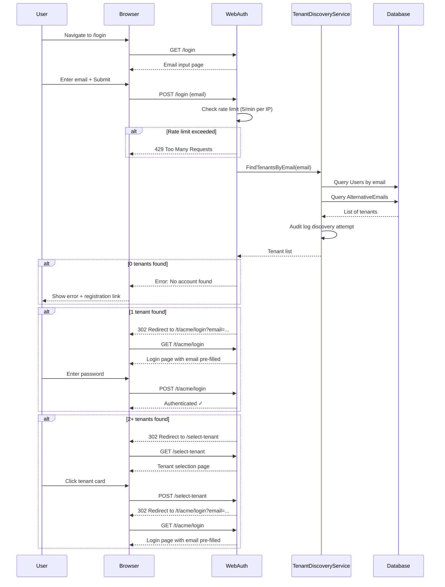
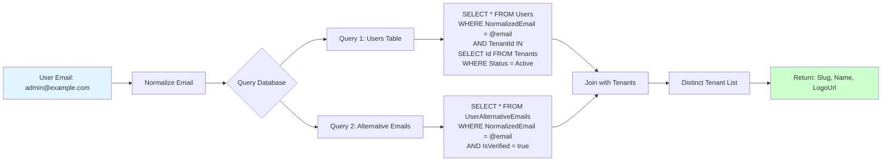
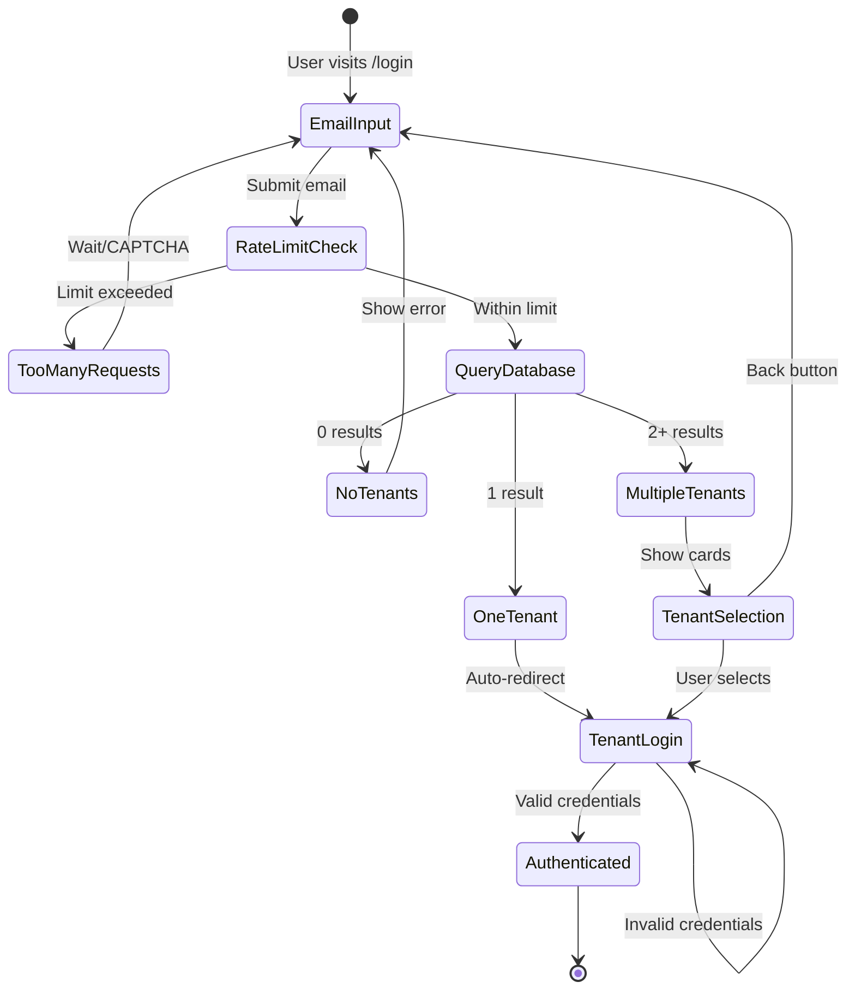
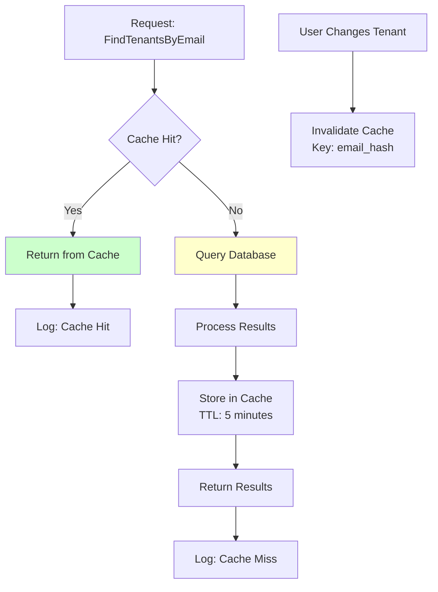
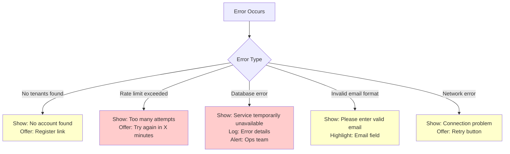
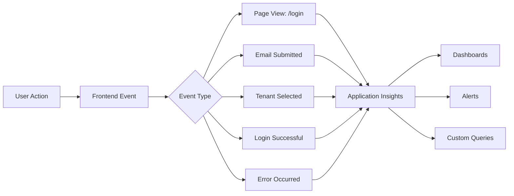
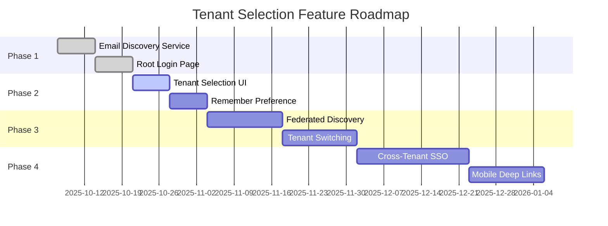

# Tenant Selection Login Flow - Visual Diagrams

## Current State (Problem)



**Problems:**
- Users don't know their tenant slug
- Support overhead
- Poor first-time experience
- Easy to make typos

---

## Proposed Solution (Email-First Flow)



**Benefits:**
- Simple, familiar UX (email-first)
- No need to remember tenant slugs
- Works for single and multi-tenant users
- Automatic tenant discovery

---

## Detailed Flow with Security



---

## Database Query Flow



---

## UI Component Hierarchy

```
┌─────────────────────────────────────────────────────┐
│ TenantDiscovery.cshtml (Root /login)                │
│                                                     │
│  ┌──────────────────────────────────────────────┐  │
│  │ Email Input Form                             │  │
│  │  - Email address field (required)            │  │
│  │  - Continue button                           │  │
│  │  - Client-side validation                    │  │
│  └──────────────────────────────────────────────┘  │
│                                                     │
│  On Submit:                                         │
│  - POST to TenantDiscoveryService                   │
│  - Store email in TempData                          │
│  - Redirect based on tenant count                   │
└─────────────────────────────────────────────────────┘

                    ↓ (if 2+ tenants)

┌─────────────────────────────────────────────────────┐
│ SelectTenant.cshtml (/select-tenant)                │
│                                                     │
│  ┌──────────────────────────────────────────────┐  │
│  │ Tenant Selection Grid                        │  │
│  │                                              │  │
│  │  ┌────────────────────────────────────────┐ │  │
│  │  │ TenantCard Component                   │ │  │
│  │  │  - Tenant Logo (or default icon)       │ │  │
│  │  │  - Tenant Name (bold)                  │ │  │
│  │  │  - Tenant Slug (muted)                 │ │  │
│  │  │  - Last Login (if available)           │ │  │
│  │  │  - "Select" button                     │ │  │
│  │  └────────────────────────────────────────┘ │  │
│  │                                              │  │
│  │  (Repeat for each tenant)                    │  │
│  │                                              │  │
│  └──────────────────────────────────────────────┘  │
│                                                     │
│  ┌──────────────────────────────────────────────┐  │
│  │ Options                                      │  │
│  │  - [x] Remember my choice                    │  │
│  │  - ← Back to email entry                     │  │
│  └──────────────────────────────────────────────┘  │
└─────────────────────────────────────────────────────┘

                    ↓ (on selection)

┌─────────────────────────────────────────────────────┐
│ Login.cshtml (/t/acme/login?email=...)              │
│                                                     │
│  ┌──────────────────────────────────────────────┐  │
│  │ Login Form                                   │  │
│  │  - Email (pre-filled, readonly)              │  │
│  │  - Password field                            │  │
│  │  - Sign In button                            │  │
│  │  - "Not you?" link (back to discovery)       │  │
│  └──────────────────────────────────────────────┘  │
└─────────────────────────────────────────────────────┘
```

---

## State Machine



---

## Data Flow Architecture

```
┌──────────────────────────────────────────────────────────┐
│                    Presentation Layer                     │
│                                                           │
│  ┌─────────────────┐  ┌─────────────────┐  ┌──────────┐ │
│  │ TenantDiscovery │  │ SelectTenant    │  │  Login   │ │
│  │    (Razor)      │  │    (Razor)      │  │ (Razor)  │ │
│  └────────┬────────┘  └────────┬────────┘  └─────┬────┘ │
│           │                     │                  │      │
└───────────┼─────────────────────┼──────────────────┼──────┘
            │                     │                  │
            ↓                     ↓                  ↓
┌──────────────────────────────────────────────────────────┐
│                    Business Logic Layer                   │
│                                                           │
│  ┌─────────────────────────────────────────────────────┐ │
│  │        ITenantDiscoveryService                      │ │
│  │  ┌───────────────────────────────────────────────┐ │ │
│  │  │ FindTenantsByEmailAsync(email)                │ │ │
│  │  │ GetPreferredTenantAsync(email, ip)            │ │ │
│  │  │ SaveTenantPreferenceAsync(email, tenantId)    │ │ │
│  │  └───────────────────────────────────────────────┘ │ │
│  └─────────────────────────────────────────────────────┘ │
│           │                                               │
│           ├── Rate Limiter (5 req/min per IP)            │
│           ├── Audit Logger                                │
│           └── Cache (5 min TTL)                           │
│                                                           │
└───────────┼───────────────────────────────────────────────┘
            ↓
┌──────────────────────────────────────────────────────────┐
│                      Data Access Layer                    │
│                                                           │
│  ┌─────────────────────────────────────────────────────┐ │
│  │              AuthDbContext                          │ │
│  │                                                     │ │
│  │  Users ←──────┐                                    │ │
│  │  UserAlternativeEmails                             │ │
│  │  Tenants                                           │ │
│  │                                                     │ │
│  │  Query: Users JOIN Tenants WHERE email = @email    │ │
│  │  Query: AltEmails JOIN Users JOIN Tenants          │ │
│  └─────────────────────────────────────────────────────┘ │
│                                                           │
└───────────┼───────────────────────────────────────────────┘
            ↓
     [PostgreSQL Database]
```

---

## Caching Strategy



**Cache Keys:**
- `tenant_discovery:{email_hash}` → List of TenantInfo
- `tenant_preference:{email_hash}` → Preferred tenant slug
- TTL: 5 minutes (balance between freshness and performance)

**Invalidation Triggers:**
- User created in new tenant
- User deleted from tenant
- Tenant suspended/deleted
- Alternative email verified

---

## Security Layers

```
┌────────────────────────────────────────────────┐
│          Layer 1: Rate Limiting                │
│  - 5 requests per minute per IP                │
│  - Redis-backed distributed counter            │
│  - 429 Too Many Requests response              │
└────────────────────────────────────────────────┘
                    ↓
┌────────────────────────────────────────────────┐
│        Layer 2: Input Validation               │
│  - Email format validation                     │
│  - Email normalization (lowercase, trim)       │
│  - Reject invalid/malicious input              │
└────────────────────────────────────────────────┘
                    ↓
┌────────────────────────────────────────────────┐
│       Layer 3: Generic Responses               │
│  - Same response time for all queries          │
│  - Don't distinguish "no email" vs "no tenant" │
│  - Artificial delay if query < threshold       │
└────────────────────────────────────────────────┘
                    ↓
┌────────────────────────────────────────────────┐
│         Layer 4: Audit Logging                 │
│  - Log all discovery attempts                  │
│  - Include: IP, email (hashed), timestamp      │
│  - Alert on suspicious patterns                │
└────────────────────────────────────────────────┘
                    ↓
┌────────────────────────────────────────────────┐
│     Layer 5: CAPTCHA (Optional)                │
│  - After 3 failed attempts                     │
│  - Proof-of-work challenge                     │
│  - Google reCAPTCHA or hCaptcha                │
└────────────────────────────────────────────────┘
```

---

## Performance Considerations

### Query Optimization

```sql
-- Optimized query with proper indexes
-- Index: Users(TenantId, NormalizedEmail)
-- Index: UserAlternativeEmails(NormalizedEmail, IsVerified)
-- Index: Tenants(Status, Id)

WITH tenant_from_primary AS (
    SELECT DISTINCT t."Id", t."Slug", t."Name", t."LogoUrl"
    FROM "Tenants" t
    INNER JOIN "Users" u ON u."TenantId" = t."Id"
    WHERE u."NormalizedEmail" = @email
      AND t."Status" = 1
),
tenant_from_alternative AS (
    SELECT DISTINCT t."Id", t."Slug", t."Name", t."LogoUrl"
    FROM "Tenants" t
    INNER JOIN "Users" u ON u."TenantId" = t."Id"
    INNER JOIN "UserAlternativeEmails" uae ON uae."UserId" = u."Id"
    WHERE uae."NormalizedEmail" = @email
      AND uae."IsVerified" = true
      AND t."Status" = 1
)
SELECT * FROM tenant_from_primary
UNION
SELECT * FROM tenant_from_alternative
ORDER BY "Name";
```

**Expected Performance:**
- Query time: < 10ms (with proper indexes)
- Cache hit rate: 80%+ (5-minute TTL)
- Total latency: < 200ms p95 (including cache, rate limit, audit)

---

## Mobile Responsive Design

```
Desktop (> 768px):
┌─────────────────────────────────────┐
│         Sign in to Acme Corp        │
│                                     │
│  Email: admin@example.com (readonly)│
│  Password: ••••••••                 │
│                                     │
│          [Sign In →]                │
│                                     │
│  Not you? Switch organization       │
└─────────────────────────────────────┘

Mobile (< 768px):
┌───────────────┐
│  Acme Corp    │
│               │
│ Email:        │
│ admin@ex...   │
│               │
│ Password:     │
│ •••••••••     │
│               │
│  [Sign In]    │
│               │
│ Not you?      │
│ Switch org    │
└───────────────┘
```

---

## Error Handling



---

## Accessibility (WCAG 2.1 AA)

**Email Input Page:**
- ✅ Label associated with input: `<label for="email">`
- ✅ Required field marked: `aria-required="true"`
- ✅ Error messages: `aria-describedby="email-error"`
- ✅ Keyboard navigation: Tab → Enter to submit
- ✅ Screen reader: "Email address, required field"

**Tenant Selection:**
- ✅ Heading hierarchy: H1 → H2 → H3
- ✅ Tenant cards: `role="button"` with `aria-label`
- ✅ Keyboard: Arrow keys to navigate, Enter to select
- ✅ Focus visible: Clear outline on focused card
- ✅ Screen reader: "Select Acme Corporation, button"

**Color Contrast:**
- Text: 4.5:1 minimum ratio
- Large text: 3:1 minimum ratio
- Interactive elements: Clear focus indicators

---

## Internationalization (i18n)

```csharp
// Resource keys for localization
"Login.EmailLabel" → "Email address" (en-US)
                  → "Adresse e-mail" (fr-FR)
                  → "E-Mail-Adresse" (de-DE)

"Login.Continue" → "Continue" (en-US)
              → "Continuer" (fr-FR)
              → "Weiter" (de-DE)

"SelectTenant.Title" → "Select your organization" (en-US)
                    → "Sélectionnez votre organisation" (fr-FR)
                    → "Wählen Sie Ihre Organisation" (de-DE)
```

---

## Analytics & Monitoring



**Key Metrics:**
- Conversion funnel: Email → Tenant → Login
- Drop-off rates at each step
- Error rates by type
- Average time-to-login
- Cache hit rate
- Rate limit triggers

---

## Future Enhancements Roadmap



---

## Summary

This visual guide provides:
- ✅ Flow diagrams for user journeys
- ✅ Sequence diagrams for technical implementation
- ✅ State machines for business logic
- ✅ Architecture diagrams for system design
- ✅ UI mockups for development reference
- ✅ Security layers visualization
- ✅ Performance optimization strategies

Use these diagrams during:
- Design reviews
- Implementation planning
- Code reviews
- Documentation
- Training sessions
