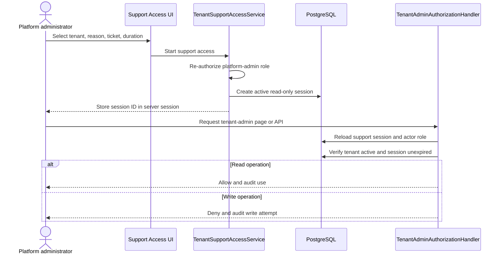
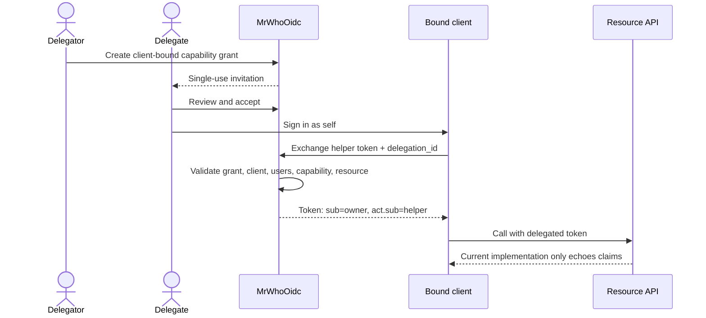

# Tenant Support Access and User Delegation Review

**Reviewed:** 2026-08-01  
**Branch:** `sol/impersonation`  
**Scope:** Platform administration support access and temporary, client-bound user-to-user delegation

## Executive conclusion

MrWhoOidc has two correctly separated foundations:

1. **Tenant Support Access** lets a platform administrator temporarily inspect one tenant as a read-only tenant administrator. This is substantially implemented and should not be called user impersonation because no user identity is assumed.
2. **Delegated Access Grants** let one tenant member authorize another tenant member to act on their behalf for one OIDC client, selected capabilities, selected resources, and a bounded time. The grant lifecycle and token-exchange foundation exist, but end-to-end resource authorization is unfinished.

The principal release blocker is not grant creation or token issuance. It is the absence of a real client operation that consumes delegated authority. The current demo proves `sub`, `act.sub`, `delegation_id`, and client binding, but its API only echoes claims. It does not enforce capability, resource, current grant state, or revocation.

| Direction | Current state | Assessment |
|---|---|---|
| Platform administrator helping manage the IdP | Durable, bounded, read-only support sessions with audit and UI | Close to releasable after hardening and operational cleanup |
| User delegating temporary rights for a client | Durable client-bound grants, invitation/acceptance UI, session activation, and RFC 8693 exchange | Foundation implemented; usable delegated business authorization is not complete |

## Findings

### High: no production resource operation uses delegated authorization

[`IDelegatedAccessAuthorizationService`](../MrWhoOidc.Auth/Services/Delegation/IDelegatedAccessAuthorizationService.cs) performs the important checks: actor, bound client, grant status and lifetime, both memberships, tenant status, capability, and resource ID. Its production caller is the token-exchange service. No client-owned API or WebAuth business operation calls it to authorize the requested resource operation.

Browser activation sets `DelegatedAccessGrantId` in the session. [`EffectiveAccessContextAccessor`](../MrWhoOidc.WebAuth/Services/EffectiveAccessContextAccessor.cs) then resolves actor and subject, but it does not authorize a capability or resource. The only account page using the accessor, [`Profile.cshtml.cs`](../MrWhoOidc.WebAuth/Pages/Account/Profile.cshtml.cs), returns no profile for delegated GET requests and forbids delegated POST requests.

**Impact:** users can create and accept grants, activate a banner, and exchange a token, but cannot complete a meaningful delegated task.

### High: the demo resource server trusts presentation rather than delegated authority

[`Examples/MrWhoOidc.TestApi/Program.cs`](../Examples/MrWhoOidc.TestApi/Program.cs) validates the JWT and returns claims from `/me`. It does not require the mapped `profile` scope, validate `delegation_id`, check that `act.sub` is the delegate, check current grant state, or authorize a resource ID. [`DelegatedApiClient`](../Examples/MrWhoOidc.RazorClient/Services/DelegatedApiClient.cs) therefore demonstrates identity propagation, not authorization.

**Impact:** the demo can pass even if a downstream service would expose the wrong resource or continue accepting a revoked delegation.

### High: revocation does not invalidate an already-issued self-contained token

Revocation immediately prevents browser context reuse and new delegated exchanges because the durable grant is reloaded. A JWT already issued to a client remains valid until its access-token expiry unless every resource server performs an online grant-state check or uses introspection/reference tokens.

**Impact:** “immediate revocation” is currently true for new authorization decisions, not for previously issued bearer JWTs. The product must document and enforce a revocation bound.

### Medium: browser context revalidation is weaker than delegated authorization

Activation validates actor, client binding, status, time window, and both memberships. Subsequent context resolution validates only grant status, time window, and actor. It does not re-check both memberships, tenant status, client validity, capability policy, or the feature flag. The display service also does not verify that the current actor is the grant's delegate.

**Impact:** membership or tenant suspension can leave a stale delegated browser context until another operation performs a stronger check. No current business operation relies on it, but it is unsafe as a future authorization boundary.

### Medium: delegated token subject identifiers bypass normal subject policy

[`TokenExchangeService`](../MrWhoOidc.Auth/Services/TokenExchangeService.cs) emits the delegator's internal `UserAccount` GUID as `sub` and the delegate's internal GUID as `act.sub`. The current code does not apply the normal public/pairwise subject calculation for the target client and sector.

**Impact:** internal identifiers can become correlatable across clients, and pairwise-subject clients receive inconsistent subject semantics.

### Medium: support-session revocation is implemented only below the UI

The support store can revoke a durable session, but the platform UI does not list active sessions with a revoke action. Starting another support session also does not end or reject the actor's previous active durable session; the browser merely replaces its session reference.

**Impact:** an incident responder cannot terminate another administrator's active support session through the product, and stale active records can remain authoritative until expiry.

### Medium: authorization and audit coverage is incomplete

Support access fails closed by HTTP method for unannotated tenant-admin requests and explicit Minimal API operation metadata is present in the main route groups. However, there is no automated endpoint-inventory test proving that every tenant-admin endpoint is classified, and unit tests cover classification helpers and the store rather than the full authorization handler.

Delegated authorization emits lifecycle, denial, and use audit events, but it does not persist `LastUsedAt` or increment `UseCount`. The lifecycle payloads include raw account IDs alongside hashed actor/subject values, and delegated events do not consistently include correlation identifiers. There are no dedicated delegated-access metrics or alerts.

### Low: support metrics count authorization as a stop

The successful support-access authorization path increments `TenantSupportAccessStops` for every use. This makes stop counts and operational dashboards inaccurate.

### Low: active documentation still reports the plan as proposed

[`tenant-support-and-delegated-access-implementation-plan.md`](tenant-support-and-delegated-access-implementation-plan.md) describes the intended model well, but its unchecked acceptance criteria and “Proposed” status no longer reflect the implementation. Historical “impersonation complete” documents also describe the superseded session-only design.

## How Tenant Support Access works now

1. A platform administrator opens `/platform-admin/support-access` and selects an active tenant.
2. A reason is required; ticket reference and duration are optional. Duration defaults to 15 minutes and is bounded to 1-60 minutes.
3. [`TenantSupportAccessService`](../MrWhoOidc.WebAuth/Services/TenantSupportAccessService.cs) verifies the platform-admin policy, creates a durable `TenantSupportAccessSession`, audits the start, and stores only its ID in ASP.NET session.
4. The tenant-admin policy reloads the durable record on each request. It verifies actor ownership, current platform-admin role, active target tenant, active status, and absolute expiry.
5. Read-only mode allows safe requests. Unsafe Razor Page methods are blocked by [`SupportAccessReadOnlyPageFilter`](../MrWhoOidc.WebAuth/Security/Admin/SupportAccessReadOnlyPageFilter.cs); the authorization handler denies write operation requirements and treats unannotated unsafe methods as writes.
6. The UI shows a persistent support banner. Explicit stop marks the record ended, audits duration, and clears the session reference. Local logout also ends the current support session.
7. A cleanup worker finalizes expired active records. The store supports revocation, although no current page exposes it.

The authenticated principal always remains the platform administrator. The effective context has the administrator as actor, no user subject, the selected tenant, and the durable support-session ID.

## How Delegated Access works now

1. The delegator and delegate must be different users with active memberships in the same tenant.
2. The delegator selects an OIDC client, an eligible delegate, a purpose, expiry, and capabilities.
3. The initial catalog allows only `profile.read`. The service binds that capability to the delegator's user resource and enforces the strictest configured/capability lifetime.
4. The grant starts in `PendingAcceptance`. A random invitation token is stored only as a SHA-256 hash and emailed to the delegate.
5. Only the invited account can accept or decline. Acceptance atomically consumes the token and activates the grant.
6. The delegator can revoke; the delegate can relinquish. The delegate can separately activate or exit a browser display context without changing grant state.
7. The bound confidential client may perform RFC 8693 token exchange using the delegate's subject token and private `delegation_id` parameter.
8. Exchange validates the client-bound grant through the central authorization service, intersects requested, subject-token, grant-mapped, and client-policy scopes, and bounds token lifetime.
9. A delegated JWT uses the delegator as `sub`, the delegate as `act.sub`, and includes `delegation_id`, `client_id`, and `azp`. Multi-hop exchange is rejected and DPoP bridging follows client policy.

This is the correct identity model: the delegate stays authenticated as themselves, the delegator remains the subject of the operation, and both identities are available for audit.

## Target release contract

The first supported user-delegation release should make a deliberately narrow promise:

- One tenant, one delegator, one delegate, one bound confidential client.
- Explicit invitation and acceptance.
- One read-only `profile.read` capability over the delegator's own profile resource.
- Delegate remains actor; delegator remains subject.
- No role copying, tenant administration, consent, sessions, credentials, MFA, recovery, email changes, grant management, or multi-hop delegation.
- Every operation is authorized online by capability and resource, and audited with actor, subject, client, grant, resource, outcome, and correlation ID.
- Revocation effectiveness is stated precisely. Recommended initial bound: online validation on every API request, or opaque/introspected delegated tokens. Do not advertise immediate JWT revocation without that control.

## Completion plan

### Phase 0: freeze semantics and repair current invariants

**Goal:** make the existing foundation safe to extend.

1. Publish the target release contract above and keep `EnableDelegatedAccess` off by default outside explicit development/demo environments.
2. Make one request-scoped delegated-context resolver call the central authorization service for a concrete client, capability, and resource. Remove the weaker duplicate validation paths as authorization boundaries.
3. Re-check feature flag, tenant, memberships, client binding, grant state, capability, and resource on every delegated operation.
4. Apply normal public/pairwise subject identifier calculation to both `sub` and the chosen actor identifier policy.
5. Define delegated-token revocation behavior: prefer opaque/introspected tokens for the first release, or add an API-side online grant-state validator with a very short bounded cache.
6. Fix support-use metrics, update grant `LastUsedAt`/`UseCount`, hash identifiers consistently, and attach trace/correlation IDs.
7. Prevent or explicitly end concurrent support sessions for one platform administrator.

**Exit criteria:** negative unit tests prove tenant suspension, membership loss, client mismatch, resource mismatch, feature disablement, expiry, and revocation all deny the next operation.

### Phase 1: implement one real delegated resource operation

**Goal:** prove authorization, not just token shape.

Build a small `Profile Assistance` resource in the demo API:

- `GET /profiles/{subjectId}/summary` requires `profile.read`.
- The API validates issuer, audience, expiry, client, `sub`, `act.sub`, and `delegation_id`.
- The API resolves the internal grant or calls a dedicated IdP authorization/introspection endpoint.
- Authorization passes the concrete resource `user:{subjectId}` to the central delegated authorization policy.
- A normal user may read only their own profile; a delegated caller may read only the delegator resource in the grant.
- The response returns useful profile data plus a compact audit reference, not raw token diagnostics.

Keep write capabilities out of this phase. `profile.update_limited` needs field-level policy, step-up authentication, and a separate security review.

**Exit criteria:** the same delegate token is denied for another user, another client, another tenant, an ungranted capability, an expired/revoked grant, and after either membership is suspended.

### Phase 2: turn the existing RazorClient sample into a coherent demo

**Goal:** demonstrate the complete human workflow without copying IDs.

1. Add a **Delegated tasks** page to the RazorClient that lists accepted grants valid for that client and current user.
2. Replace manual grant-ID paste with an explicit grant selector showing delegator, capability, purpose, and expiry.
3. Exchange the signed-in delegate's token server-side and call the Profile Assistance endpoint.
4. Display “You are helping Alice” with actor, subject, bound client, capability, resource, and remaining time.
5. Add **Stop helping** to discard the delegated token/context without revoking the grant.
6. Add **Relinquish grant** for the delegate and retain **Revoke** for the delegator.
7. Demonstrate immediate/defined-bound revocation: keep the page open, revoke in the delegator session, retry, and show a controlled denial.
8. Keep a separate diagnostics disclosure for token claims; claims should support the story rather than be the task itself.

**Demo script:**

1. Alice creates a one-hour `profile.read` grant for Bob, bound to RazorClient.
2. Bob receives the MailHog invitation, reviews the exact authority, and accepts.
3. Bob signs into RazorClient as Bob, selects Alice's accepted task, and reads Alice's profile summary.
4. Bob cannot read Carol's profile or mutate Alice's profile.
5. A second client cannot use the grant.
6. Alice revokes the grant; Bob's next API request is denied within the documented revocation bound.
7. Audit history shows Alice as subject, Bob as actor, RazorClient as client, the profile resource, and both successful and denied attempts.

### Phase 3: finish Tenant Support Access operations

**Goal:** make privileged support access controllable by operations and incident responders.

1. Add an active-session view with actor, tenant, reason, ticket, start, expiry, and status.
2. Allow another currently authorized platform administrator to revoke a session with a required reason.
3. Add per-actor concurrent-session policy and transaction-safe enforcement.
4. Add full authorization-handler tests for role removal, tenant suspension, actor mismatch, expiry, revocation, read allow, and write deny.
5. Add endpoint inventory tests for all tenant-admin Razor handlers and Minimal APIs; fail when a new endpoint lacks an operation classification.
6. Remove remaining active “impersonation” labels and filenames after the compatibility window, retaining the term only in migration/history notes.
7. Add expiry warnings and audit/session links to the banner and history UI.

### Phase 4: operationalize and expand cautiously

**Goal:** make the feature supportable before adding authority.

1. Add counters and latency for grant create, accept, decline, activate, authorize, deny, revoke, expire, exchange, and resource use.
2. Add alerts for denial spikes, repeated wrong-user invitation use, client mismatches, and support-session write attempts.
3. Document retention, privacy treatment, incident revocation, feature rollback, and the exact token revocation bound.
4. Add concurrency tests for accept-versus-revoke and duplicate invitation consumption.
5. Add desktop/mobile E2E coverage for create, accept, use, wrong resource, wrong client, exit, expiry, membership loss, and revocation.
6. Run migration upgrade/rollback tests against a populated pre-feature database.
7. Require a capability-specific threat model and security approval before enabling any new capability, especially writes.

## Test strategy

| Layer | Required proof |
|---|---|
| Domain | Valid lifecycle transitions, invitation single use, concurrency, lifetime, immutable client/tenant/users |
| Authorization | Deny-by-default matrix for actor, subject, client, tenant, membership, capability, resource, time, status |
| Protocol | Scope/audience intersection, pairwise subjects, DPoP, single-hop, opaque/JWT behavior, revoked grant |
| Resource API | Actual object-level authorization and online revocation behavior |
| Browser | Explicit acceptance/activation/exit, dual-identity display, no silent authority switch |
| Support access | Full handler behavior and endpoint inventory, including all unsafe methods |
| Operations | Audit reconstruction, metrics, alerts, retention, and feature-disable rollback |

## Definition of done

- A delegated grant authorizes at least one real client resource operation and no broader operation.
- The resource server validates capability, resource, current grant state, and both identities; it does not rely only on claims display.
- Revocation behavior for issued tokens is enforced and documented with a measurable upper bound.
- Normal and pairwise subject identifier rules are preserved.
- Browser, token, API, and audit paths agree on actor, subject, tenant, client, grant, capability, and resource.
- Support access can be independently revoked, has tested endpoint coverage, and remains read-only.
- Negative tests cover every trust boundary and outnumber or match positive delegated-authorization tests.
- Feature flags, dashboards, alerts, runbooks, privacy/retention guidance, and migration tests are complete.
- A focused security review approves `profile.read` before production enablement.

## Recommended implementation order

Start with Phase 0 and the read-only Profile Assistance operation. Do not add more capabilities until that operation proves object-level authorization and revocation end to end. Then polish the existing RazorClient into the user-facing demo, finish support-session operations, and only afterward evaluate limited write delegation.