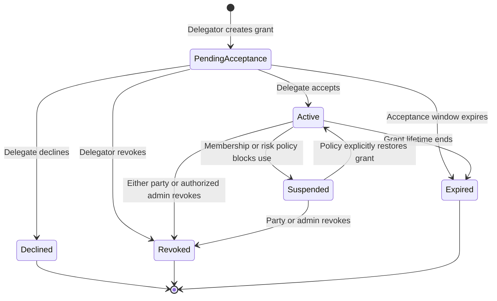

# Tenant Support Access and Delegated Access Grants Implementation Plan

> **Partially implemented design, not an entirely proposed feature.** The [implementation review](impersonation-and-delegated-access-review-2026-08-01.md) records the delivered support-access and delegated-profile slice and remaining release risks. Preserve unchecked acceptance criteria until backed by focused tests; do not equate the demo with production adoption. Status routing updated 2026-09-05; see [documentation follow-up](documentation-status.md).

**Date:** 2026-07-19  
**Status:** Partially implemented. See the [2026-08-01 implementation review](impersonation-and-delegated-access-review-2026-08-01.md) for verified current behavior, remaining gaps, and the recommended completion order.
**Priority:** Security-critical rename and hardening, followed by new feature delivery  
**Owners:** MrWhoOidc Auth, WebAuth, Security, and Operations maintainers

## Executive Summary

MrWhoOidc currently has a feature named "impersonation" that allows a platform administrator to select a tenant and satisfy the tenant-admin authorization policy. It does not select or become another user, does not use that user's permissions, and does not involve user consent. The authenticated platform administrator remains the actor.

The existing feature must be renamed to **Tenant Support Access** and hardened as privileged, temporary platform support access. The term **impersonation** must not be used for this behavior because it inaccurately implies an identity switch.

MrWhoOidc also needs a separate **Delegated Access Grant** feature. A delegated access grant allows one user, the **delegator**, to give another user, the **delegate**, temporary and constrained authority to perform specific actions on the delegator's behalf. The delegate remains authenticated as themselves. Authorization and audit records preserve both the delegator and delegate identities.

The two features must remain separate:

| Feature | Actor | Authority source | Target | Consent | Intended use |
|---|---|---|---|---|---|
| Tenant Support Access | Platform administrator | Platform support policy | Tenant | Platform policy and support justification | Troubleshooting and support |
| Delegated Access Grant | Delegate user | Explicit grant from delegator | Delegator-owned resources in one tenant | Delegator creates and delegate accepts | Temporary user-to-user delegation |

This plan first closes the security gap in the current read-only support feature, then introduces delegated access through a durable grant model, centralized authorization, explicit acceptance, immediate revocation, dual-identity audit, and optional OAuth token representation using `sub` plus `act` semantics.

---

## 1. Terminology and Naming Standard

### 1.1 Required product terms

Use these terms consistently in code, UI, API contracts, logs, metrics, documentation, and tests:

| Term | Definition |
|---|---|
| **Tenant Support Access** | Temporary access by an authorized platform operator to inspect or support a tenant. It does not assume a tenant user's identity. |
| **Support access session** | Durable, bounded record authorizing one platform administrator to access one tenant for support. |
| **Delegated Access Grant** | Durable authorization created by one user and accepted by another user, allowing constrained actions on behalf of the first user. |
| **Delegator** | User granting authority over their own resources or actions. Also the subject of delegated operations. |
| **Delegate** | User receiving and exercising delegated authority. Also the actor. |
| **Actor** | Identity that initiated the current request or operation. |
| **Subject** | Identity on whose behalf the operation is performed. |
| **Capability** | Stable, server-defined action identifier that may be delegated, such as `profile.read`. |
| **Grant scope** | Tenant, bound client, resource constraints, capabilities, and time window attached to a delegated grant. |

### 1.2 Terms to remove or restrict

- Remove **impersonation** from all Tenant Support Access names and text.
- Do not describe Delegated Access as "logging in as," "becoming," or "switching to" another user.
- Reserve OAuth `scope` for OAuth protocol scopes. Use **capability** for application authorization actions unless an explicit mapping is being discussed.
- Use **support access** for platform-to-tenant access and **delegated access** for user-to-user grants.
- Use **On-Behalf-Of (OBO)** only for RFC 8693 token exchange and downstream service delegation. Browser delegated access may authorize an OBO exchange, but is not itself the token-exchange protocol.

### 1.3 Code rename map

| Current name | Required name |
|---|---|
| `IImpersonationService` | `ITenantSupportAccessService` |
| `ImpersonationService` | `TenantSupportAccessService` |
| `ImpersonationInfo` | `TenantSupportAccessInfo` |
| `ImpersonationAuditLog` | Replace with `TenantSupportAccessSession` and standard `AuditEvent` entries |
| `ImpersonationAction` | Remove after audit migration |
| `ImpersonatingTenantId` | `TenantSupportAccessSessionId` |
| `ReadOnlyAdminPageModel` | Remove after centralized enforcement, or rename temporarily to `SupportAccessReadOnlyPageModel` |
| `ReadOnlyModeExtensions` | Remove after centralized enforcement |
| `/platform-admin/impersonation` | `/platform-admin/support-access` |
| `/platform-admin/impersonation-history` | `/platform-admin/support-access/history` |
| `/StartImpersonation` | `/StartSupportAccess` during compatibility period, then remove |
| `/StopImpersonation` | `/StopSupportAccess` during compatibility period, then remove |

### 1.4 User-facing language

Use:

- "Start tenant support access"
- "Support access is active for Contoso"
- "Read-only support access"
- "Reason or support ticket"
- "End support access"
- "Delegate access"
- "Acting on behalf of Alice in Contoso"
- "Revoke delegated access"

Do not use:

- "Impersonate tenant"
- "Impersonate user"
- "Log in as Alice"
- "You are Alice"
- "Switch identity"

---

## 2. Goals and Non-Goals

### 2.1 Tenant Support Access goals

- Rename the feature everywhere without changing its intended platform-support purpose.
- Make read-only behavior a centralized authorization boundary, not a UI convention.
- Make support sessions durable, time-bounded, attributable, revocable, and observable.
- Revalidate platform privilege and tenant state on every support-authorized request.
- Preserve the platform administrator as the authenticated actor.
- Prevent support access from issuing tokens as a tenant user.
- Provide complete start, operation, denial, stop, expiry, and revocation audit records.

### 2.2 Delegated Access Grant goals

- Let an active tenant member grant another active tenant member specific, temporary capabilities.
- Require explicit delegate acceptance before authority becomes active.
- Preserve the delegate as actor and delegator as subject in authorization and audit.
- Permit only server-defined, explicitly delegable capabilities.
- Enforce tenant, capability, resource, time, membership, and revocation constraints on every request.
- Prevent privilege amplification, grant chaining, and delegation of administrative or credential operations by default.
- Support immediate revocation by either party and policy-driven revocation by administrators.
- Support browser/API operations first and optional RFC 8693 integration in a later phase.

### 2.3 Non-goals

- Password sharing or session sharing.
- Creating an authentication cookie for the delegator.
- Replacing the authenticated `ClaimsPrincipal` with the delegator's principal.
- General platform administrators acting as arbitrary end users.
- Unbounded delegation of complete roles.
- Delegation across tenants.
- Delegation to users without an active membership in the target tenant for the initial release.
- Multi-hop or transitive delegation.
- Delegating MFA, password, recovery, WebAuthn, email ownership, consent, grant creation, or other identity-proofing operations.
- Replacing existing RFC 8693 OBO policy. Delegated grants may later become an additional authorization input to token exchange.

---

## 3. Current-State Assessment

### 3.1 Current support feature behavior

The current implementation:

1. Requires the `platform-admin` policy when support access starts.
2. Stores the selected tenant ID, start time, and audit start ID in ASP.NET session.
3. Grants `tenant-admin` when the stored tenant ID matches the effective request tenant.
4. Keeps the platform administrator's original identity and platform privileges.
5. Advertises read-only behavior.

Primary files:

- `MrWhoOidc.WebAuth/Services/ImpersonationService.cs`
- `MrWhoOidc.WebAuth/Security/Admin/TenantAdminAuthorizationHandler.cs`
- `MrWhoOidc.WebAuth/Pages/PlatformAdmin/Impersonation.cshtml`
- `MrWhoOidc.WebAuth/Pages/PlatformAdmin/Impersonation.cshtml.cs`
- `MrWhoOidc.WebAuth/Pages/StartImpersonation.cshtml.cs`
- `MrWhoOidc.WebAuth/Pages/StopImpersonation.cshtml.cs`
- `MrWhoOidc.WebAuth/Pages/Shared/_ImpersonationBanner.cshtml`
- `MrWhoOidc.WebAuth/Pages/Admin/ReadOnlyAdminPageModel.cs`
- `MrWhoOidc.WebAuth/Extensions/ReadOnlyModeExtensions.cs`
- `MrWhoOidc.Auth/Persistence/ImpersonationAuditLog.cs`

### 3.2 Security gaps that block release under the current claims

1. Read-only enforcement covers only a small number of Razor PageModels.
2. Tenant-admin Minimal API mutation endpoints do not check support-access state.
3. Authorization does not revalidate platform-admin status after start.
4. Authorization does not consistently revalidate tenant active state.
5. The session has an idle timeout but no explicit absolute expiration.
6. There is no durable active-session record or forced revocation.
7. Logout and session eviction can leave incomplete audit pairs.
8. Start does not require a support reason or ticket.
9. Operations are not linked to a support session in the audit stream.
10. Automated tests do not prove that all unsafe methods are denied.

Phase A below must be completed before the UI may continue claiming that support access is read-only.

---

## 4. Architectural Decisions

### AD-1: Keep actor and subject distinct

Do not replace the authenticated user principal. Resolve an immutable request-level context:

```csharp
public sealed record EffectiveAccessContext(
    Guid ActorUserAccountId,
    Guid SubjectUserAccountId,
    Guid TenantId,
    AccessContextKind Kind,
    Guid? SupportAccessSessionId,
    Guid? DelegatedAccessGrantId);
```

Rules:

- Normal request: actor equals subject.
- Tenant Support Access: actor remains platform administrator; there is no user subject. Use tenant support context, not a fabricated subject user.
- Delegated Access: actor is delegate and subject is delegator.
- Exactly one elevated context may be active. Support access and delegated access cannot be combined.

### AD-2: Bind grants to global accounts, one tenant, and one client

Use immutable `UserAccount.Id` values for delegator and delegate. Require both accounts to have active, unexpired `UserTenantMembership` records in the grant tenant.

Bind every grant to exactly one tenant-scoped OAuth/OIDC client using immutable `Client.Id`. The client identifies the application in which delegated authority may be exercised. A grant created for one client must never authorize browser operations, token exchange, or API access through another client.

Do not bind grants by email, username, or mutable tenant-local profile data.

Tenant-local `User` records may be resolved when an operation requires them, but they are not the grant's identity authority. Any remaining ambiguity between `UserAccount` and tenant-local `User` must be resolved before delegated access is enabled for that operation.

### AD-3: Delegate capabilities, not roles

Do not copy or assign roles to the delegate. Define a central capability catalog with metadata:

```csharp
public sealed record DelegableCapabilityDefinition(
    string Name,
    string DisplayName,
    string Description,
    bool IsDelegable,
    bool RequiresStepUp,
    TimeSpan MaximumGrantLifetime,
    IReadOnlySet<string> AllowedResourceTypes);
```

Authorization requires all of:

1. Capability is server-defined and delegable.
2. Delegator currently possesses authority for the capability and resource.
3. Grant contains the capability.
4. Resource matches grant constraints.
5. Grant and memberships are active.
6. Operation is not in the non-delegable deny list.

### AD-4: Deny by default

- Unknown capabilities are non-delegable.
- New sensitive operations are non-delegable until explicitly registered.
- Empty capability lists grant nothing.
- Missing resource constraints do not mean all resources unless the capability explicitly supports tenant-wide delegation.
- Administrative and identity-security capabilities remain non-delegable in the first release.

### AD-5: Use durable records with immediate revocation

ASP.NET session may hold only opaque references to active contexts. Authoritative status lives in PostgreSQL. Every privileged authorization checks a short-lived cache backed by the database and supports immediate invalidation.

### AD-6: Centralize enforcement

Razor inheritance and UI disabling are insufficient. Enforcement must occur in authorization handlers, endpoint filters, or middleware shared by all relevant endpoints.

### AD-7: Preserve OAuth subject semantics

Internal `UserAccount.Id` values identify grant parties in persistence and audit. Tokens continue to use the subject identifier appropriate for the client and sector, including pairwise subjects where configured.

When delegated tokens are introduced:

- `sub` identifies the delegator using normal subject-identifier rules.
- `act.sub` identifies the delegate using a stable actor identifier appropriate for the target audience.
- `client_id` or `azp` identifies the grant-bound client that exercised the delegation.
- Include a private `delegation_id` or equivalent grant reference only when policy permits it.
- Never expose internal database IDs by default.

---

## 5. Tenant Support Access Target Design

### 5.1 Persistence model

Add `TenantSupportAccessSession` under `MrWhoOidc.Auth/Persistence`:

```text
Id                         UUID primary key
PlatformAdminUserAccountId UUID required
TenantId                   UUID required
Mode                       ReadOnly initially; enum permits future controlled modes
Status                     Active, Ended, Expired, Revoked
Reason                     required, bounded text
TicketReference            optional, bounded text
CreatedAt                  required
ExpiresAt                  required
EndedAt                    optional
RevokedAt                  optional
RevokedByUserAccountId     optional
RevocationReason           optional
LastSeenAt                 optional
CreatedFromIpHash          optional
UserAgentHash              optional
ConcurrencyToken           required
```

Indexes:

- `(PlatformAdminUserAccountId, Status, ExpiresAt)`
- `(TenantId, Status, ExpiresAt)`
- `(Status, ExpiresAt)` for cleanup
- Optional partial uniqueness preventing more than one active support session per browser actor if product policy requires it

Foreign keys:

- Actor to `UserAccount`
- Tenant to `Tenant`
- Revoker to `UserAccount`

Do not place this entity behind a tenant query filter that can hide platform-wide support records. Access it through an explicit platform-scoped repository that always applies authorization and target-tenant filtering intentionally.

### 5.2 Configuration

Add validated options:

```json
{
  "TenantSupportAccess": {
    "Enabled": true,
    "DefaultLifetimeMinutes": 15,
    "MaximumLifetimeMinutes": 60,
    "RequireReason": true,
    "RequireTicketReference": false,
    "AllowWriteMode": false,
    "RevalidateIntervalSeconds": 15
  }
}
```

Production validation must reject:

- Non-positive lifetimes
- Default lifetime greater than maximum
- Write mode enabled without an explicit implementation and policy
- Missing durable storage support

### 5.3 Start flow

1. Require authentication and `platform-admin` authorization.
2. Require recent authentication; require MFA when the account has MFA or platform policy mandates it.
3. Validate target tenant is active.
4. Require a bounded reason and optional ticket reference.
5. Create the durable session with absolute expiry.
6. Store only `TenantSupportAccessSessionId` in ASP.NET session.
7. Emit `tenant_support_access.started` audit event.
8. Redirect to the tenant's admin dashboard.

### 5.4 Request-time validation

For every request attempting to use support access:

1. Load the referenced session from cache/database.
2. Verify actor account matches the authenticated `UserAccountId` claim.
3. Reauthorize the actor against `platform-admin`.
4. Verify target tenant matches resolved tenant and remains active.
5. Verify status is Active and current time is before `ExpiresAt`.
6. Verify requested operation is allowed by support mode.
7. Update `LastSeenAt` asynchronously through bounded background work.
8. Deny and clear the session reference on any failed invariant.

Do not grant `tenant-admin` solely because a session key contains a tenant ID.

### 5.5 Central read-only enforcement

Create a `TenantAdminOperationRequirement` with operation classification:

```csharp
public enum TenantAdminOperationKind
{
    Read,
    Write,
    SecuritySensitiveWrite
}
```

Rules:

- Normal tenant admins continue through existing role authorization.
- Active read-only support sessions may satisfy `Read` only.
- Support sessions must be denied for `Write` and `SecuritySensitiveWrite`.
- Platform-admin status alone must not bypass operation classification.

Apply enforcement to:

- Every tenant-admin Minimal API endpoint through route-group endpoint filters or explicit policies.
- Every `/Admin` Razor unsafe request (`POST`, `PUT`, `PATCH`, `DELETE`) through a global Razor filter or authorization middleware.
- Any mutation implemented as GET must be changed to an unsafe method.
- SignalR, SSE commands, background command endpoints, file uploads, and export/import operations.

Remove voluntary `EnforceReadOnlyMode` calls and PageModel inheritance after centralized enforcement is proven.

### 5.6 Stop, expiry, and revocation

- Actor can end their own session.
- Another platform administrator can revoke any active session with a required reason.
- Logout clears the ASP.NET session reference and ends the durable support session when possible.
- Expired sessions are denied immediately and finalized by a background cleanup service.
- Session-store eviction does not leave the durable session indefinitely active; cleanup transitions it to Expired.
- Status transitions use conditional updates to prevent concurrent stop/revoke races.

### 5.7 Support access audit and observability

Emit standard `AuditEvent` records for:

- `tenant_support_access.started`
- `tenant_support_access.used`
- `tenant_support_access.write_denied`
- `tenant_support_access.ended`
- `tenant_support_access.expired`
- `tenant_support_access.revoked`
- `tenant_support_access.validation_failed`

Every event includes:

- Support session ID
- Actor account ID or protected stable reference
- Target tenant ID
- Operation and resource category
- Result
- Reason/ticket where appropriate
- Correlation/trace ID
- Timestamp
- PII-safe IP and user-agent metadata

Metrics:

- Active support sessions
- Starts, stops, expirations, revocations
- Write-denial count
- Validation-failure count by reason
- Session duration histogram

Alert on unusual session volume, repeated write attempts, and sessions approaching configured maximum duration.

### 5.8 Rename and compatibility migration

1. Add new service, page, partial, policy, metric, and audit names.
2. Redirect old GET page URLs to new URLs for one compatibility release.
3. Old POST endpoints must either call the new service with all new validation or return `410 Gone`; do not retain old session-only behavior.
4. On deployment, clear legacy `ImpersonatingTenantId`, `ImpersonationStartTime`, and `ImpersonationStartLogId` values. Existing sessions must not silently gain new support-session authority.
5. Keep the old audit table read-only during one release if history retention requires it.
6. Provide a migration or unified history projection labeling old entries as `LegacySupportAccess`.
7. Remove old routes, classes, session keys, CSS identifiers, metrics, and documentation after the compatibility window.

---

## 6. Delegated Access Grant Target Design

### 6.1 Grant lifecycle



Terminal states cannot become active again. Regranting creates a new grant ID.

### 6.2 Persistence model

Add `DelegatedAccessGrant`:

```text
Id                         UUID primary key
TenantId                   UUID required
ClientId                   UUID required
DelegatorUserAccountId     UUID required
DelegateUserAccountId      UUID required
Status                     PendingAcceptance, Active, Declined, Suspended, Revoked, Expired
CapabilitiesJson           bounded canonical JSON array
ResourceConstraintsJson    bounded validated JSON object
Purpose                    required bounded text
CreatedAt                  required
AcceptanceExpiresAt        required
AcceptedAt                 optional
StartsAt                   optional
ExpiresAt                  required
DeclinedAt                 optional
RevokedAt                  optional
RevokedByUserAccountId     optional
RevocationReason           optional
LastUsedAt                 optional
UseCount                   counter or separately aggregated metric
Version                    concurrency token
```

Add `DelegatedAccessGrantEvent` only if standard `AuditEvent` cannot provide immutable, queryable lifecycle history. Prefer standard audit events plus the current grant state to avoid duplicate audit systems.

Add `DelegatedAccessInvitationToken` if acceptance uses emailed links:

```text
Id
GrantId
TokenHash
CreatedAt
ExpiresAt
ConsumedAt
RevokedAt
```

Store only a cryptographic hash of invitation tokens. Redemption must use an atomic conditional update.

Indexes and constraints:

- `(TenantId, DelegatorUserAccountId, Status, ExpiresAt)`
- `(TenantId, DelegateUserAccountId, Status, ExpiresAt)`
- `(TenantId, ClientId, Status, ExpiresAt)`
- `(Status, ExpiresAt)`
- Delegator and delegate must differ
- `ExpiresAt > CreatedAt`
- `AcceptanceExpiresAt <= ExpiresAt`
- Capabilities JSON must be non-empty and canonical
- Maximum lengths for purpose and resource constraints
- Foreign keys to tenant, the bound client, and both `UserAccount` rows
- Bound client must belong to the grant tenant; client deletion is restricted while grant history exists

Apply tenant query filters and tenant write guards because delegated grants are tenant-bound. Platform-wide investigation must use explicit privileged queries.

### 6.3 Initial capability catalog

Start with a deliberately small allowlist. Final names must follow `<resource>.<action>`:

| Capability | Initial status | Notes |
|---|---|---|
| `profile.read` | Delegable | Read delegator-visible profile data allowed by resource policy |
| `profile.update_limited` | Candidate after domain review | Excludes primary email, credentials, MFA, recovery, and legal identity fields |
| `documents.read` | Candidate | Only if a concrete document resource exists |
| `documents.manage` | Candidate | Requires resource IDs and strong audit |
| `approvals.review` | Candidate | Must prohibit self-approval and conflicts of interest |
| `sessions.read` | Non-delegable | Security-sensitive |
| `sessions.revoke` | Non-delegable | Security-sensitive |
| `credentials.*` | Non-delegable | Password, MFA, WebAuthn, recovery, linked identities |
| `delegation.manage` | Non-delegable | Prevents chaining and grant takeover |
| `consent.manage` | Non-delegable | User consent must remain personal |
| `tenant_admin.*` | Non-delegable | Delegation is not role assignment |
| `client_secret.*` | Non-delegable | Administrative credential operation |

Before implementation, inventory actual self-service operations and assign each one:

- Delegable with resource constraints
- Delegable only after step-up
- Never delegable
- Not applicable

This inventory becomes a checked-in capability catalog and test data source. No operation may infer delegability from naming alone.

### 6.4 Grant creation rules

The delegator must:

1. Be authenticated through a global `UserAccount` identity.
2. Have an active, unexpired membership in the selected tenant.
3. Select a delegate with an active, unexpired membership in the same tenant.
4. Select the tenant client in which the delegate may exercise the grant.
5. Select only registered delegable capabilities.
6. Currently possess every selected capability for every constrained resource.
7. Complete recent authentication and step-up MFA for sensitive candidate capabilities.
8. Supply a purpose and expiration within policy limits.

The service must:

- Reject self-delegation.
- Reject tenant administrators attempting to create a grant for another user unless a separate administrative-grant feature is explicitly approved later.
- Reject role names, arbitrary policy strings, wildcard capabilities, and unvalidated resource JSON.
- Normalize and canonicalize capabilities and resource constraints before persistence.
- Validate and persist the selected client as part of immutable grant scope.
- Create the grant as `PendingAcceptance`.
- Create a single-use acceptance token and notify the delegate.
- Notify the delegator that the invitation was created.

### 6.5 Acceptance rules

The delegate must:

1. Authenticate as the exact invited `UserAccount`.
2. Have an active membership in the grant tenant.
3. Review delegator identity, tenant, bound client, purpose, capabilities, resources, start, and expiry.
4. Explicitly accept or decline.

Acceptance must atomically transition `PendingAcceptance` to `Active`, consume the invitation token, and record `AcceptedAt`. Concurrent acceptance attempts must result in exactly one successful transition.

Acceptance must not widen or edit the grant. Any requested change requires the delegator to revoke and create a new grant.

### 6.6 Selecting and exercising delegated context

Delegated access must never activate merely because an active grant exists.

Browser flow:

1. Delegate opens **Delegated to me**.
2. Delegate selects one active grant and chooses **Act on behalf of <name>**.
3. Server stores an opaque active-grant reference in session.
4. Every page shows a persistent banner naming both actor and subject, tenant, bound client, capabilities summary, and expiry.
5. Delegate can exit delegated context without revoking the grant.

API flow:

- Require an explicit `delegation_id` for delegated token exchange. The authenticated exchanging client must match the grant's bound client.
- Do not trust a free-form `X-Delegation-Id` header with an otherwise unrelated bearer token.
- Initial API release may require token exchange to mint a short-lived delegated token.

Only one delegated context may be active per browser session. Tenant switching exits delegated context unless the selected grant belongs to the destination tenant.

### 6.7 Authorization evaluation

Add core Auth abstractions:

```csharp
public interface IDelegatedAccessAuthorizationService
{
    Task<DelegatedAuthorizationResult> AuthorizeAsync(
        ClaimsPrincipal actor,
        Guid grantId,
        Guid clientId,
        string capability,
        DelegatedResource resource,
        CancellationToken cancellationToken = default);
}
```

Evaluation order:

1. Resolve actor `UserAccountId` from trusted claims.
2. Load grant by ID and tenant.
3. Require `Active` state and valid time window.
4. Require actor equals `DelegateUserAccountId`.
5. Require the caller client equals the grant's `ClientId`.
6. Require delegator and delegate memberships remain active and unexpired.
7. Require target tenant remains active.
8. Require capability exists, is delegable, and is present in the grant.
9. Require requested resource matches typed constraints.
10. Re-evaluate delegator's current authority for that capability/resource.
11. Apply operation-specific conflict and separation-of-duties rules.
12. Return an `EffectiveAccessContext` containing actor, subject, tenant, client, and grant ID.

Never authorize solely from claims copied into a long-lived cookie. Cache results briefly, key them by grant version, and invalidate on revocation, membership changes, capability-policy changes, account lockout, and tenant suspension.

### 6.8 Browser identity and rendering rules

- `User.Identity.Name` continues to identify the delegate.
- Do not rewrite `NameIdentifier` to the delegator.
- Expose `EffectiveAccessContext` to handlers and views.
- Resource queries use subject identity only after authorization has succeeded.
- Writes record both actor and subject.
- The banner must be present on every page in delegated context and must not rely on individual pages opting in.
- Pages that cannot safely operate in delegated context must deny access rather than silently falling back to actor context.

### 6.9 Token and OBO integration

Deliver browser authorization before delegated token issuance. In a later protocol phase:

1. Add a narrowly defined token-exchange path authorized by an active delegated grant.
2. Reuse `TokenExchangeService` audience, scope intersection, lifetime, DPoP, and delegation-depth controls.
3. Require an explicit `delegation_id` request parameter and reject missing, malformed, unknown, cross-tenant, or wrong-client grants.
4. Map capabilities to OAuth scopes explicitly; do not assume names are interchangeable.
5. Effective scopes equal requested scopes intersected with:
   - Delegator's subject-token scopes
   - Grant-mapped scopes
   - Client OBO policy scopes
   - Target resource policy
6. Token lifetime is the minimum of subject token remainder, grant remainder, client OBO maximum, and server delegated-token maximum.
7. Emit `sub` for delegator, `act` for delegate, `client_id`/`azp` for the bound client, and protected `delegation_id` context.
8. Reject a subject token that already has an `act` claim unless a future, explicit multi-hop policy is approved.
9. Revocation must prevent new exchanges immediately. Existing delegated tokens must be very short-lived or checked through introspection/revocation state for high-risk resources.

### 6.10 Revocation and automatic invalidation

Revocation rights:

- Delegator may revoke grants they created.
- Delegate may relinquish grants assigned to them.
- Authorized tenant/platform administrators may revoke for security response, but cannot use the grant.

Automatically suspend or revoke when:

- Either tenant membership becomes suspended, revoked, or expired.
- Tenant becomes inactive.
- Either account is disabled or locked according to policy.
- Capability is removed from the delegable catalog.
- Delegator no longer possesses the underlying authority.
- Risk policy detects misuse.

Use conditional updates and a concurrency token. Revocation must publish cache invalidation and security events.

### 6.11 Notifications

Use the existing `IEmailSender` abstraction and in-app UI notifications where available.

Notify both parties on:

- Invitation creation
- Acceptance
- Decline
- Revocation or relinquishment
- Grant expiry approaching
- Grant expiration
- Administrative suspension/revocation
- Sensitive delegated operation, where capability policy requires it

Email links must contain only opaque single-use tokens, never grant capability details that reveal sensitive data. The authenticated confirmation page displays authoritative grant details.

### 6.12 Audit and privacy

Emit:

- `delegated_access.created`
- `delegated_access.accepted`
- `delegated_access.declined`
- `delegated_access.activated`
- `delegated_access.used`
- `delegated_access.denied`
- `delegated_access.exited`
- `delegated_access.revoked`
- `delegated_access.suspended`
- `delegated_access.expired`

Each use/denial event includes:

- Grant ID
- Tenant ID
- Actor account reference
- Subject account reference
- Capability
- Resource type and protected resource reference
- Outcome and denial reason
- Client ID and audience when protocol tokens are involved
- Bound client ID on every lifecycle, use, and denial event
- Correlation/trace ID
- Timestamp

Do not log raw invitation tokens, cookies, access tokens, PII-rich resource content, or unrestricted purpose text. Apply existing audit hashing and retention policies.

---

## 7. API and UI Surface

### 7.1 Tenant Support Access pages

Platform pages:

- `GET /platform-admin/support-access`
- `POST /platform-admin/support-access/start`
- `POST /platform-admin/support-access/{id}/end`
- `POST /platform-admin/support-access/{id}/revoke`
- `GET /platform-admin/support-access/history`

UI requirements:

- Tenant selector
- Required reason and optional ticket
- Explicit read-only mode label
- Absolute expiry selection bounded by policy
- Active-session list with actor, tenant, reason, started, expires, and status
- Revoke control for authorized platform administrators
- Persistent support banner with actor, tenant, mode, and remaining time
- No text suggesting a tenant user identity is assumed

### 7.2 Delegated Access self-service pages

Account pages:

- `GET /account/delegated-access`
- `GET /account/delegated-access/granted-by-me`
- `GET /account/delegated-access/delegated-to-me`
- `GET|POST /account/delegated-access/create`
- `GET|POST /account/delegated-access/invitations/{token}`
- `POST /account/delegated-access/{id}/revoke`
- `POST /account/delegated-access/{id}/relinquish`
- `POST /account/delegated-access/{id}/activate`
- `POST /account/delegated-access/exit`

UI requirements:

- Separate **Granted by me** and **Delegated to me** views
- Status, tenant, bound client, counterparty, purpose, capabilities, resources, created, accepted, and expiry
- Clear warning that credentials and administrative authority are not shared
- Explicit acceptance summary
- Persistent dual-identity banner while active
- Confirmation for revocation
- Accessible status text and non-color-only indicators
- Mobile and desktop layouts without hidden security context

### 7.3 Management APIs

Use versioned, typed DTOs and Problem Details errors. Suggested routes:

- `POST /api/v1/delegated-access/grants`
- `GET /api/v1/delegated-access/grants?direction=granted|received`
- `GET /api/v1/delegated-access/grants/{id}`
- `POST /api/v1/delegated-access/grants/{id}/accept`
- `POST /api/v1/delegated-access/grants/{id}/decline`
- `POST /api/v1/delegated-access/grants/{id}/revoke`
- `POST /api/v1/delegated-access/grants/{id}/activate`
- `POST /api/v1/delegated-access/context/exit`

All cookie-authenticated mutations require antiforgery protection. Bearer API operations require appropriate audience and scopes. Never expose grants from another tenant or grants where the caller is neither party nor an authorized auditor.

### 7.4 Error model

Use stable codes without disclosing unrelated users or grants:

- `delegation_not_found`
- `delegation_not_active`
- `delegation_expired`
- `delegation_revoked`
- `delegate_mismatch`
- `membership_inactive`
- `capability_not_delegable`
- `capability_not_granted`
- `resource_not_granted`
- `delegator_authority_lost`
- `step_up_required`
- `delegation_conflict`

Return 404 where distinguishing forbidden from nonexistent would create an enumeration risk.

---

## 8. Service and Project Placement

### 8.1 `MrWhoOidc.Auth`

Place non-visual business logic here:

- `Persistence/TenantSupportAccessSession.cs`
- `Persistence/DelegatedAccessGrant.cs`
- Entity configurations in `AuthDbContext`
- EF Core migrations
- `Services/SupportAccess/ITenantSupportAccessStore.cs`
- `Services/Delegation/IDelegatedAccessGrantService.cs`
- `Services/Delegation/IDelegatedAccessAuthorizationService.cs`
- `Services/Delegation/IDelegableCapabilityCatalog.cs`
- `Services/Delegation/DelegatedAccessPolicy.cs`
- Grant lifecycle and atomic transition logic
- Membership and authority revalidation
- Cache interfaces and invalidation events
- Cleanup/expiry services that do not depend on HTTP

### 8.2 `MrWhoOidc.WebAuth`

Place HTTP and UI concerns here:

- Support-access Razor Pages and banners
- Delegated-access self-service Razor Pages
- Minimal API mappings and DTOs
- Antiforgery and authorization filters
- `EffectiveAccessContext` resolution middleware/accessor
- Browser session references
- Email link construction
- HTTP audit metadata
- Protocol endpoint integration

### 8.3 `MrWhoOidc.Security`

Use only for reusable cross-cutting primitives if needed, such as actor/subject claim parsing. Do not move domain persistence or grant policy into this project.

### 8.4 `MrWhoOidc.UnitTests` and `e2e`

- Unit and integration tests beside existing authorization, persistence, and token tests.
- Add all new Razor pages to the corresponding E2E account/platform-admin suites.
- Add protocol-flow tests only when delegated token exchange is implemented.

---

## 9. Implementation Phases

## Phase A: Correct Naming and Close Existing Security Gaps

### Work

1. Introduce new Tenant Support Access names and compatibility routes.
2. Add durable `TenantSupportAccessSession` and migration.
3. Add absolute expiry, reason, ticket, status, and revocation.
4. Replace tenant-ID session authorization with session-ID validation.
5. Add centralized operation classification and read-only enforcement.
6. Revalidate platform-admin status and tenant state on every use.
7. Clear/end support access on logout.
8. Add operation-level audit, metrics, cleanup, and forced revocation.
9. Remove false UI claims until centralized enforcement is active.
10. Add comprehensive tests.

### Acceptance criteria

- [ ] No active user-facing surface calls the feature impersonation.
- [ ] No new code type, route, metric, or audit event uses impersonation terminology for support access.
- [ ] Old GET URLs redirect to the new names during the compatibility release.
- [ ] Legacy session keys cannot grant tenant-admin authorization.
- [ ] Every active support context references a durable, unexpired, non-revoked session.
- [ ] Platform-admin removal causes the next support-authorized request to fail.
- [ ] Tenant suspension causes the next support-authorized request to fail.
- [ ] Support actor mismatch causes denial and session-reference removal.
- [ ] All tenant-admin Minimal API mutations are denied during read-only support access.
- [ ] All `/Admin` unsafe methods are denied during read-only support access.
- [ ] Read-only GET operations required for troubleshooting remain available.
- [ ] Logout ends or invalidates the current support session.
- [ ] Another authorized platform administrator can revoke an active session.
- [ ] Expired sessions cannot be used and are eventually finalized as Expired.
- [ ] Start requires a reason and enforces configured lifetime bounds.
- [ ] Audit records preserve actor, tenant, support session, operation, outcome, and correlation ID.
- [ ] Automated endpoint inventory proves every tenant-admin endpoint has an operation classification.

## Phase B: Delegation Domain Foundation

### Work

1. Approve capability naming and initial catalog.
2. Inventory self-service operations and classify delegability.
3. Add `DelegatedAccessGrant` and invitation-token entities.
4. Add indexes, constraints, tenant filters, and write guards.
5. Implement lifecycle transitions with optimistic concurrency/conditional updates.
6. Implement membership, tenant, capability, and underlying-authority validation.
7. Implement audit events and cache invalidation.
8. Add configuration and startup validation.

### Acceptance criteria

- [ ] Grants bind immutable `UserAccount` IDs, exactly one tenant, and exactly one client in that tenant.
- [ ] Both parties must have active, unexpired memberships in that tenant.
- [ ] Self-delegation and cross-tenant delegation are rejected.
- [ ] Unknown, wildcard, role-based, empty, and non-delegable capabilities are rejected.
- [ ] Grant lifetime cannot exceed the strictest selected capability policy.
- [ ] Resource constraints are typed, bounded, canonicalized, and validated.
- [ ] Only valid lifecycle transitions are possible.
- [ ] Concurrent accept/revoke operations produce exactly one valid final transition.
- [ ] Invitation tokens are random, hashed at rest, single-use, and time-bounded.
- [ ] No grant is usable before explicit delegate acceptance.
- [ ] No active grant can authorize `credentials.*`, `delegation.manage`, `consent.manage`, or tenant-admin operations.
- [ ] Unit tests cover every capability-catalog entry and lifecycle transition.

## Phase C: Delegated Access Self-Service Experience

### Work

1. Build grant creation, review, acceptance, decline, revoke, and relinquish pages.
2. Add notification emails and authenticated acceptance links.
3. Add **Granted by me** and **Delegated to me** lists.
4. Add activate/exit delegated browser context.
5. Add persistent actor/subject banner.
6. Add recent-authentication and MFA step-up integration.
7. Add antiforgery and rate limits.

### Acceptance criteria

- [ ] Delegator can select only eligible delegates in the same tenant without user enumeration outside that tenant.
- [ ] Creation UI displays exact capabilities, resources, and expiry before confirmation.
- [ ] Delegate sees authoritative grant details, including the bound client, before acceptance.
- [ ] Only the invited account can accept or decline.
- [ ] Email token replay and concurrent acceptance are rejected.
- [ ] Activation is explicit; an accepted grant does not silently change request authority.
- [ ] Every delegated page displays actor, subject, tenant, bound client, and expiry.
- [ ] Exiting context returns immediately to normal actor authority without revoking the grant.
- [ ] Revocation takes effect on the next request.
- [ ] UI and API mutation requests enforce antiforgery or bearer authorization as appropriate.
- [ ] E2E tests cover desktop and mobile creation, acceptance, activation, use, exit, expiry, and revocation.

## Phase D: Resource Authorization Integration

### Work

1. Add `EffectiveAccessContext` accessor.
2. Integrate delegated authorization into one low-risk resource vertical slice.
3. Convert handlers to explicit capability/resource authorization.
4. Ensure data queries use subject identity only after authorization.
5. Record actor and subject on every read/write audit event.
6. Expand capability integration one resource area at a time.

Recommended first slice: a read-only, low-risk self-service resource. Do not start with credentials, sessions, consent, administration, financial approval, or destructive operations.

### Acceptance criteria

- [ ] Normal requests continue to have actor equal subject.
- [ ] Delegated requests preserve delegate identity as actor and delegator identity as subject.
- [ ] Handlers never infer delegated subject from query/form input.
- [ ] A grant for resource A cannot access resource B.
- [ ] A read capability cannot perform writes.
- [ ] Delegator authority loss denies subsequent delegated use.
- [ ] Delegate membership loss denies subsequent delegated use.
- [ ] Tenant suspension denies subsequent delegated use.
- [ ] No delegated operation can create or modify another grant.
- [ ] Audit logs can reconstruct who acted, for whom, on what, under which grant, and with what outcome.
- [ ] Negative authorization tests outnumber or match positive-path tests for each integrated capability.

## Phase E: OAuth/OBO Delegated Token Integration

### Work

1. Define capability-to-scope mappings.
2. Extend token exchange with a grant-authorized flow.
3. Emit subject and actor claims without exposing internal IDs.
4. Enforce audience, scope intersection, grant remainder, OBO policy, DPoP, and depth.
5. Extend introspection and audit output with protected delegation context.
6. Add revocation behavior appropriate to token format.

### Acceptance criteria

- [ ] Delegated tokens are issued only for active, accepted grants.
- [ ] `sub` identifies the delegator under normal subject-identifier rules.
- [ ] `act.sub` identifies the delegate under the approved actor-identifier rules.
- [ ] The authenticated exchanging client equals the grant's bound client.
- [ ] Effective scopes cannot exceed subject token, grant, client policy, or resource policy.
- [ ] Effective audience must be explicitly allowed by both client and grant/resource policy.
- [ ] Lifetime does not exceed grant remainder or configured delegated-token maximum.
- [ ] Multi-hop delegation is rejected.
- [ ] DPoP binding cannot be weakened during exchange.
- [ ] Pairwise subject behavior remains correct for the target client/sector.
- [ ] Revoked grants cannot produce new delegated tokens.
- [ ] Protocol negative tests cover altered grant IDs, actor mismatch, expired grants, scope escalation, audience substitution, replay, and delegation depth.

## Phase F: Operational Rollout and Legacy Removal

### Work

1. Deploy schema and dormant services behind feature flags.
2. Enable support hardening before enabling delegated grants.
3. Pilot delegated access with one low-risk capability and selected tenants.
4. Monitor denial, revocation, and error metrics.
5. Expand the capability catalog only through security review.
6. Remove compatibility routes and legacy audit implementation.
7. Refresh architecture wiki and operator/admin/developer documentation.

### Acceptance criteria

- [ ] Rollback can disable delegated use without deleting grant history.
- [ ] Feature disablement denies activation/use but still permits authorized revocation and audit access.
- [ ] No active legacy session survives the support-access migration.
- [ ] Legacy routes and types are removed after the announced compatibility window.
- [ ] Operators have dashboards and alerts for both features.
- [ ] Data retention and deletion behavior is documented and tested.
- [ ] Security review signs off before adding write-capable delegated capabilities.

---

## 10. Testing Strategy

### 10.1 Unit tests

Tenant Support Access:

- Start authorization and recent-authentication requirements
- Required reason and lifetime bounds
- Actor/session binding
- Platform-role revalidation
- Tenant-status revalidation
- Read versus write classification
- Stop/revoke/expire races
- Logout cleanup
- Cache invalidation

Delegated Access:

- Every lifecycle transition
- Membership and tenant validation
- Capability registration and deny-by-default behavior
- Resource constraint parsing and matching
- Underlying delegator-authority revalidation
- Actor/subject context construction
- Revocation and expiry
- Notification token hashing and atomic consumption
- Concurrency and replay

### 10.2 Integration tests

Use PostgreSQL where atomic updates, indexes, query filters, or concurrency semantics matter.

- Two concurrent support session revocations
- Two concurrent invitation acceptances
- Revocation during a delegated request
- Membership suspension during active context
- Tenant suspension during active support/delegated context
- Cache invalidation across two application instances
- Query-filter isolation across tenants
- Migration from legacy audit/session behavior

### 10.3 Authorization matrix tests

For every operation, test:

| Context | Read | Write | Security-sensitive write |
|---|---:|---:|---:|
| Normal authorized user | Policy-dependent | Policy-dependent | Policy-dependent |
| Normal unauthorized user | Deny | Deny | Deny |
| Read-only support access | Allow when classified support-readable | Deny | Deny |
| Delegate with matching capability/resource | Allow if granted | Allow only if explicitly delegable | Deny initially |
| Delegate with wrong resource | Deny | Deny | Deny |
| Delegate with expired/revoked grant | Deny | Deny | Deny |

Generate an endpoint manifest test that fails when a new tenant-admin or delegable endpoint lacks operation/capability metadata.

### 10.4 E2E tests

Add to:

- `e2e/tests/test_platform_admin_pages.py`
- `e2e/tests/test_account_pages.py`
- A focused delegated-access flow file if the suite organization warrants it

Required flows:

- Start/end/revoke/expire Tenant Support Access
- Direct API write attempt during read-only support access
- Legacy URL redirect
- Create, accept, decline, activate, exit, revoke, and expire delegation
- Wrong-user acceptance
- Cross-tenant attempt
- Banner persistence across navigation
- Tenant switch exits or denies context
- Delegated resource success and out-of-scope denial

### 10.5 Security tests

- CSRF on every cookie-authenticated mutation
- IDOR against grant/session IDs
- User and grant enumeration
- Invitation-token entropy, storage, replay, and expiry
- Session fixation and actor mismatch
- Privilege removal after context activation
- Capability/resource JSON tampering
- Race conditions in lifecycle transitions
- Audit injection and log redaction
- OBO scope/audience escalation
- Pairwise subject leakage
- DPoP downgrade or binding loss
- Multi-hop delegation attempts

### 10.6 Performance and resilience tests

- Authorization latency with and without cache
- Revocation propagation across replicas
- Grant-list pagination with large history
- Cleanup of expired sessions and grants
- Bounded notification/background queues
- Database query plans for active-grant indexes
- Fail-closed behavior during cache or database errors

---

## 11. Security Requirements

The following are release-blocking:

- Authorization fails closed when authoritative grant/session state cannot be checked.
- Neither feature changes authentication credentials or shares cookies.
- Both identities are preserved for delegated operations.
- Support access cannot issue tokens as tenant users.
- Delegated access cannot reach password, MFA, WebAuthn, recovery, linked identities, consent, session revocation, delegation management, tenant administration, or client secrets in the initial release.
- All state-changing browser requests use antiforgery validation.
- All invitation and activation tokens are cryptographically random, hashed at rest, bounded, and single-use.
- All state transitions are concurrency-safe.
- Revocation is checked on every privileged request or through a bounded cache with immediate invalidation.
- Purpose/reason fields are encoded safely and excluded from unstructured logs.
- Audit events never include raw tokens, cookies, secrets, or sensitive resource content.
- Rate limits cover creation, invitation resend, acceptance, activation, and authorization failures.
- Pagination and maximum result sizes cover all history/list endpoints.

---

## 12. Observability and Operations

### 12.1 Dashboards

Tenant Support Access:

- Active sessions by tenant and actor
- Session starts, endings, expirations, revocations
- Write attempts denied
- Validation failures
- Duration distribution

Delegated Access:

- Pending and active grants
- Creation, acceptance, decline, revocation, expiry rates
- Authorization success/denial by capability
- Denial reasons
- Invitation delivery failures
- Revocation propagation latency

### 12.2 Alerts

- High support-session creation rate
- Repeated support-mode write attempts
- Support sessions exceeding expected duration
- High delegation denial or token-replay rate
- Revocation propagation failure
- Cleanup backlog
- Notification backlog
- Database/cache errors affecting authorization

### 12.3 Operational controls

- Feature flags independently control Tenant Support Access and Delegated Access.
- Platform emergency control revokes all active support sessions.
- Tenant emergency control suspends all delegated grants in that tenant.
- Account security response revokes/suspends all grants involving an account.
- Operator runbooks cover investigation, revocation, audit export, and recovery.

---

## 13. Migration and Deployment

### 13.1 Database migrations

Create migrations using the repository-standard command:

```bash
dotnet ef migrations add AddTenantSupportAndDelegatedAccess \
  --project MrWhoOidc.Auth \
  --startup-project MrWhoOidc.WebAuth \
  --output-dir Persistence/Migrations
```

Prefer separate migrations for:

1. `AddTenantSupportAccessSessions`
2. `AddDelegatedAccessGrants`
3. Legacy impersonation audit retirement after compatibility period

Do not hand-edit the model snapshot or database schema.

### 13.2 Safe rollout order

1. Deploy additive schema.
2. Deploy new support service with old feature disabled for migration window if necessary.
3. Invalidate legacy session keys.
4. Enable new Tenant Support Access.
5. Verify centralized read-only enforcement and audit.
6. Deploy Delegated Access domain disabled.
7. Enable invitation-only pilot for selected tenants and capabilities.
8. Enable broader self-service after security and operational review.
9. Add protocol token integration separately.
10. Remove legacy names/routes/table after retention and compatibility requirements are met.

### 13.3 Rollback

- Disabling Tenant Support Access denies new starts and existing use; authorized stop/revoke remains available.
- Disabling Delegated Access denies activation and use; grant listing, revocation, and audit remain available.
- Existing records remain intact for audit.
- Rollback must never restore legacy tenant-ID session authorization.

---

## 14. Documentation Deliverables

Update:

- `docs/admin-guide.md`: support access administration and delegated-grant policy
- `docs/production-setup-guide.md`: configuration, feature flags, and security defaults
- `docs/developer-guide.md`: effective access context and capability authorization
- `docs/reference/obo-client-policy.md`: delegated-grant token exchange when implemented
- `docs/for-operators/monitoring/alerting-rules.md`: metrics and alerts
- `docs/security-review.md`: threat model and residual risks
- `wiki/` architecture pages and `wiki/log.md`
- API/OpenAPI descriptions
- User help for creating, accepting, using, and revoking delegated grants

Documentation must explicitly state:

- Support access does not impersonate a user.
- Delegated access does not share credentials or change login identity.
- Delegate and delegator are both recorded.
- Which capabilities can and cannot be delegated.
- Expiry and revocation behavior.
- Token `sub` and `act` semantics when protocol integration is enabled.

---

## 15. Definition of Done

The combined initiative is complete only when:

- [ ] Tenant Support Access is correctly named across active code and product surfaces.
- [ ] Legacy impersonation terminology remains only in migration/history documentation where needed.
- [ ] Read-only support access is centrally and comprehensively enforced.
- [ ] Support sessions are durable, bounded, revalidated, revocable, and auditable.
- [ ] Delegated grants require explicit creation and acceptance by the correct parties.
- [ ] Grants bind immutable accounts, one tenant, explicit capabilities, typed resources, and expiry.
- [ ] Actor and subject remain distinct in authorization, UI, audit, and tokens.
- [ ] Revocation and membership/tenant changes take effect within the documented bound.
- [ ] No privilege can be delegated unless present in the reviewed capability catalog.
- [ ] Administrative and identity-security operations are non-delegable by default.
- [ ] Browser and API enforcement share the same core authorization service.
- [ ] Unit, integration, E2E, security, concurrency, and endpoint-inventory tests pass.
- [ ] Full solution build and test suites pass without new warnings attributable to the feature.
- [ ] EF migrations apply to a populated pre-feature database and rollback procedures are tested.
- [ ] Metrics, alerts, runbooks, retention, and privacy behavior are operational.
- [ ] Admin, user, developer, operator, protocol, and architecture documentation is updated.
- [ ] A security review approves each capability before production enablement.

---

## 16. Open Decisions Requiring Product or Security Approval

1. Which concrete self-service resources should form the first delegated-access vertical slice?
2. Is delegate discovery limited to existing tenant members, or should email invitations provision membership in a later release?
3. Which capabilities require MFA step-up at creation, acceptance, activation, or each sensitive use?
4. What are the default and maximum grant lifetimes per capability?
5. May tenant administrators revoke grants for incident response, and what audit reason is required?
6. Is support access permanently read-only, or will a separately approved emergency write mode ever exist?
7. What subject identifier is used for `act.sub` across audiences while preserving privacy and correlation requirements?
8. Which resources require delegated-token introspection for immediate revocation rather than short-lived JWTs?
9. What retention periods apply to grant records, invitation records, and operation-level audit events?
10. Which notification channels are mandatory before a grant or sensitive delegated action becomes effective?

Until resolved, implementations must choose the more restrictive behavior and fail closed.