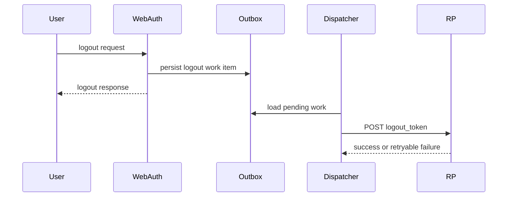

Back-channel logout is implemented as a durable, retryable delivery workflow rather than a synchronous best-effort call. That keeps RP notification separate from the interactive logout request and allows delivery monitoring and retry behavior.

## Flow Shape

## Responsibilities

- `LogoutHandler` shapes the logout token with the required claims and `typ=logout+jwt`.
- The Auth persistence layer stores the outbox work items.
- `BackchannelLogoutDispatcher` performs background fan-out with retry and health/metrics integration.

## Constraints

- Audit behavior should avoid logging raw JWTs.
- Replay protection and strict RP-side validation are important follow-on concerns.
- This area is operationally sensitive because it crosses service boundaries and may fail independently of user logout UX.

## Related Pages

- [[mrwhooidc-auth]]
- [[mrwhooidc-webauth]]
- [[oidc-protocol-surface]]