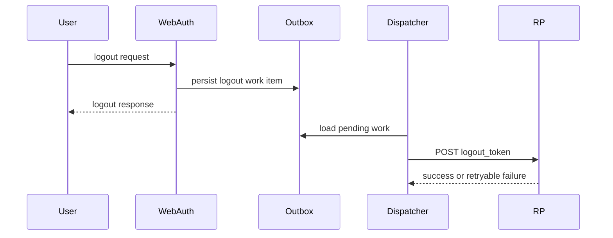

Back-channel logout is implemented as a durable, retryable delivery workflow rather than a synchronous best-effort call. That keeps RP notification separate from the interactive logout request and allows delivery monitoring and retry behavior.

## Flow Shape

```mermaid
sequenceDiagram
  participant User
  participant WebAuth
  participant Outbox
  participant Dispatcher
  participant RP

  User->>WebAuth: logout request
  WebAuth->>Outbox: persist logout work item
  WebAuth-->>User: logout response
  Dispatcher->>Outbox: load pending work
  Dispatcher->>RP: POST logout_token
  RP-->>Dispatcher: success or retryable failure
```

## Responsibilities

- `EndSessionHandler` handles `/connect/endsession`; `LogoutTargetResolver` decides who is logged out and whom to notify.
- The subject comes only from the OP session user or from an `id_token_hint` whose signature and issuer verify (expired hints are accepted; a hint naming a different user than the session is ignored). A `sid` query parameter is never used for targeting.
- Only RPs that received authorization codes or hold live tokens for that user are notified, each with its own pairwise-aware `sub`; the hint's `sid` is sent only to the RP it was issued to. Front-channel iframes follow the same target list.
- `BackChannelLogoutEnqueuer` persists outbox rows; `LogoutTokenService` builds the `typ=logout+jwt` token.
- `BackchannelLogoutDispatcher` performs background fan-out with retry, circuit breaker, and health/metrics integration across all tenants (cross-tenant queries with `IgnoreQueryFilters()`).

## Constraints

- Audit behavior should avoid logging raw JWTs.
- Strict RP-side validation (JWKS, `jti` replay) is the RP's responsibility.
- This area is operationally sensitive because it crosses service boundaries and may fail independently of user logout UX.

## Related Pages

- [[mrwhooidc-auth]]
- [[mrwhooidc-webauth]]
- [[oidc-protocol-surface]]