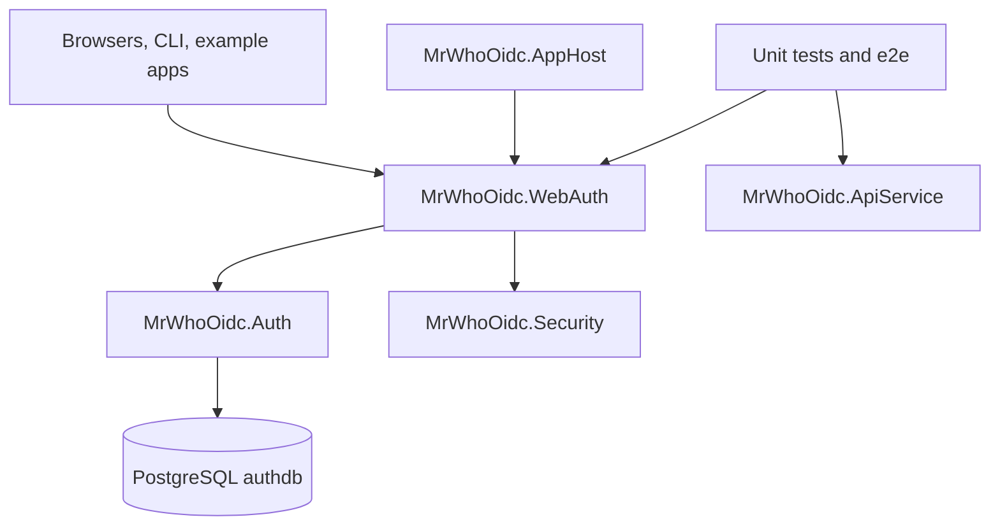

MrWhoOidc is a .NET 10 OpenID Connect and OAuth 2.0 provider with PostgreSQL-backed persistence, a tenant-aware admin UI, example clients, a CLI, and both unit and browser E2E coverage. The repository is organized as a set of focused projects, with protocol logic centered in `MrWhoOidc.Auth` and HTTP/UI exposure centered in `MrWhoOidc.WebAuth`.

## High-Level Architecture

## Major Building Blocks

- [[mrwhooidc-auth]] owns protocol rules, persistence, crypto, key management, and EF Core state.
- [[mrwhooidc-webauth]] exposes discovery, token, userinfo, logout, and admin UI surfaces through minimal APIs and Razor Pages.
- `MrWhoOidc.Security` holds cross-cutting helpers such as DPoP-related functionality.
- [[mrwhooidc-apphost]] wires local development orchestration for the Aspire workflow.
- [[mrwhooidc-cli]] provides administrative automation for tenants, realms, clients, and import/export flows.
- [[e2e-test-suite]] exercises the UI and protocol flows end to end through Playwright and Python helpers.

## Runtime Modes

- [[deployment-modes]] describes the three main ways the repo runs: seeded local Docker Compose, Aspire AppHost, and production-oriented container deployment.
- Development defaults to `docker compose -f docker-compose.dev.yml up -d --build` and seeds the default tenant and admin account.
- Production uses `docker-compose.yml` and requires explicit bootstrap rather than development auto-seeding.

## Cross-Cutting Concepts

- [[oidc-protocol-surface]] maps the main OIDC and OAuth endpoints and how responsibilities split between Auth and WebAuth.
- [[backchannel-logout]] captures the durable outbox pattern used for back-channel logout delivery.
- [[testing-strategy]] captures the layered test strategy across .NET and Python.

## Documentation Posture

- `docs/` is the curated documentation hub and remains the best human entry point by role and workflow.
- This wiki complements `docs/` by keeping a compact, interlinked architectural map inside the repo.
- If a wiki statement conflicts with code or curated docs, the wiki should be corrected.